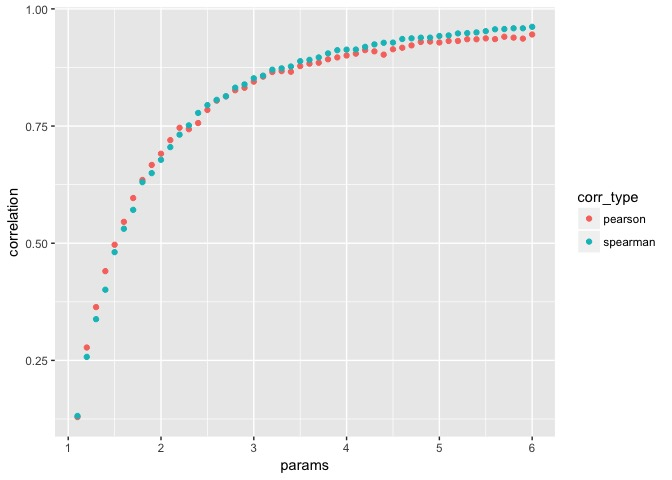

Home assignment 1
================
Mykola Pavlov
1/22/2017

-   [Problem 1: Descriptive Statistics](#problem-1-descriptive-statistics)
-   [Problem 2: Inferential Statistics](#problem-2-inferential-statistics)

Problem 1: Descriptive Statistics
---------------------------------

### Task 1a

``` r
set.seed(3)
data <- rnorm(50, mean = 10, sd = 3)
print(c(mean=mean(data), variance=var(data), median=median(data), quantile(data, p=c(.25, .75))))
```

    ##      mean  variance    median       25%       75% 
    ##  9.808234  7.125712  9.648574  7.768437 12.202916

### Task 1b

``` r
df <- data.frame(x=data)
df %>% 
  ggplot(aes(x=x)) + 
  geom_histogram(colour="black", binwidth = 2)
```


``` r
df %>% 
  ggplot() + 
  geom_boxplot(aes(x='', y=x), colour="black") + 
  labs(x="random variable", y="values")
```


### Taks 2a

It can be seen that median and both quartiles were less affected by the presence of the outliers, than mean and variance.

``` r
p <- 49
x0 <- 16 + seq(0:p)*(24 - 16) / p
df <- rbind(df, x0[40]) 
print(c(mean=mean(df$x), variance=var(df$x), median=median(df$x), quantile(df$x, p=c(.25, .75))))
```

    ##      mean  variance    median       25%       75% 
    ## 10.057693 10.156901  9.783765  7.771219 12.284514

``` r
df %>% 
  ggplot() + 
  geom_boxplot(aes(x='', y=x), colour="black") + 
  labs(x="random variable", y="values")
```


### Taks 2b

``` r
set.seed(3)
m <- sample(10:100, 6)
df <- m %>% 
  map_df(function(n) {
    data.frame(x = c(data, rnorm(n, mean = 20, sd = 2)), size = n)
  })
```

### Taks 2c

``` r
df %>% 
  ggplot(aes(x)) +
  geom_histogram(colour="black", binwidth = 2) +
  facet_wrap(~ size)
```


``` r
df %>% 
  ggplot(aes(factor(size), x)) +
  geom_boxplot() +
  labs(x="Size", y="Values")
```


``` r
df %>% 
  ggplot(aes(x)) +
  geom_histogram(colour="black", binwidth = 2)
```


### Task 2d

``` r
estimate_mode <- function(x) {
  d <- density(x)
  d$x[which.max(d$y)]
}

plot_hist <- function(size, mean, data) {
  x <- c(data, rnorm(size, mean, sd = 2))
  df <- data.frame(x, size)
  df %>%
    ggplot(aes(x)) +
    geom_histogram(colour="black", binwidth = 2) +
    geom_vline(aes(xintercept = mean(x)), color = "red", linetype="dotted") +
    geom_vline(aes(xintercept = median(x)), color = "blue", linetype="dotted") +
    geom_vline(aes(xintercept = estimate_mode(x)), color = "green", linetype="dotted")
}

manipulate(
  plot_hist(size, mean, data),
  size = slider(10, 100),
  mean = slider(10, 100)
)
```


### Task 3b

``` r
set.seed(2)
p <- 0.8
size = 100
u <- rnorm(size)
v <- rnorm(size)
v <- p * u + sqrt(1 - p^2) * v
c("Pearson" = cor(u, v), "Spearman" = cor(u, v, method = "spearman"))
```

    ##   Pearson  Spearman 
    ## 0.8348842 0.8178458

### Task 3c

``` r
v_exp <- exp(v)
c("Pearson" = cor(u, v_exp), "Spearman" = cor(u, v_exp, method = "spearman"))
```

    ##   Pearson  Spearman 
    ## 0.7207265 0.8178458

### Task 4a

``` r
C5 <- toeplitz(seq(1, 0, length.out = 5))
C10 <- toeplitz(seq(1, 0, length.out = 10))
C20 <- toeplitz(seq(1, 0, length.out = 20))

# Create Cholesky matrix
Cholesky5 <- chol(C5)
Cholesky10 <- chol(C10)
Cholesky20 <- chol(C20)

set.seed(77)
# Generate a k-dimensional sample of size n from a normal distribution with the given correlation matrix.
Z5x50 <- as.matrix(do.call(rbind, lapply(1:5, function(x) rnorm(50))))
Z10x1000 <- as.matrix(do.call(rbind, lapply(1:10, function(x) rnorm(1000))))
Z20x10000 <- as.matrix(do.call(rbind, lapply(1:20, function(x) rnorm(10000))))

Y50x5 <- t(Cholesky5 %*% Z5x50)
Y1000x10 <- t(Cholesky10 %*% Z10x1000)
Y10000x20 <- t(Cholesky20 %*% Z20x10000)
```

### Task 4b

``` r
C1 <- cor(Y50x5)
C2 <- cor(Y1000x10)
C3 <- cor(Y10000x20)
```

``` r
corrplot(C1)
```


``` r
corrplot(C2)
```


``` r
corrplot(C3)
```


### Task 5a

``` r
set.seed(100)

simulate_by_gumbel <- function(param, size) {
  gumbel <- gumbelCopula(param, dim = 2)
  mvd_gumbel <- mvdc(copula=gumbel, c("norm", "t"),
                   paramMargins=list(list(mean=0, sd=1), list(df=5)))
  rMvdc(size, mvd_gumbel)
}

simulate_by_clayton <- function(param, size) {
  clayton <- claytonCopula(-.5, dim = 2)
  mvd_clayton <- mvdc(clayton, c("norm", "t"),
                      paramMargins=list(list(mean=0, sd=1), list(df=5)))
  rMvdc(size, mvd_clayton)
}
```

``` r
x1 <- simulate_by_gumbel(2, 1000)
cor(x1)
```

    ##           [,1]      [,2]
    ## [1,] 1.0000000 0.6669689
    ## [2,] 0.6669689 1.0000000

``` r
x2 <- simulate_by_clayton(-0.7, 1000)
cor(x2)
```

    ##            [,1]       [,2]
    ## [1,]  1.0000000 -0.4893665
    ## [2,] -0.4893665  1.0000000

``` r
colnames(x1) <- c("var1", "var2")
pairs.panels(x1)
```


``` r
colnames(x2) <- c("var1", "var2")
pairs.panels(x2)
```


### Task 5b

``` r
set.seed(333)
size <- 10000
gumbel_params <- seq(1.1, 6, 0.1)
cor_gumbel_pearson <- sapply(gumbel_params, function(param) { 
  cor(simulate_by_gumbel(param, size))[1,2] 
})

cor_gumbel_spearman <- sapply(gumbel_params, function(param) { 
  cor(simulate_by_gumbel(param, size), method = "spearman")[1,2] 
})

df_gumbel <- data.frame(params = gumbel_params, 
                        pearson = cor_gumbel_pearson, 
                        spearman = cor_gumbel_spearman) 

# clayton_params <- seq(-1, 1, 0.04)
clayton_params <- seq(-1, 1000, 5)
cor_clayton_pearson <- sapply(clayton_params, function(param) { 
  cor(simulate_by_clayton(param, size))[1,2] 
})

cor_clayton_spearman <- sapply(clayton_params, function(param) { 
  cor(simulate_by_clayton(param, size), method = "spearman")[1,2] 
})

df_clayton <- data.frame(params = clayton_params, 
                         pearson = cor_clayton_pearson, 
                         spearman = cor_clayton_spearman)
```

From the plot below we can see that correlation grows as parameter of the Gumbel generator function grows from 1 to 6. Pearson and Spearman correlation functions look almost the same.

``` r
df_gumbel %>%
  gather(corr_type, correlation, -params) %>%
  ggplot(aes(params, correlation)) +
  geom_point(aes(color = corr_type))
```



From the plot below we can see that there is no clear relation between parameter value and correlation both for Pearson and Spearmen functions. Though values seem to cluster in the interval between -0.46 and -0.48.

``` r
df_clayton %>%
  gather(corr_type, correlation, -params) %>%
  ggplot(aes(params, correlation)) +
  geom_point(aes(color = corr_type))
```


### Taks 6a

``` r
kde <- density(data, kernel = "gaussian", bw = "nrd0")
plot(kde)
```


### Taks 6b

``` r
plot_denisty2d <- function(df) {
  df %>%
    ggplot(aes(V1, V2)) +
    facet_wrap(~sample_size) +
    stat_density2d(aes(alpha=..level..), geom="polygon") +
    geom_point(colour="red", alpha=0.1, size = rel(0.3))+
    theme_bw()
}

set.seed(77)
ex1 <- cbind(simulate_by_gumbel(5, 10), sample_size = 10)
ex2 <- cbind(simulate_by_gumbel(5, 50), sample_size = 50) 
ex3 <- cbind(simulate_by_gumbel(5, 100), sample_size = 100)
ex4 <- cbind(simulate_by_gumbel(5, 1000), sample_size = 1000)
df <- as.data.frame(rbind(ex1, ex2, ex3, ex4))
```

From the contour plot below we can see that as number of samples grows, bivariate density estimation follows the data density more precisly.

``` r
df %>%
  plot_denisty2d(.)
```


Problem 2: Inferential Statistics
---------------------------------

### Task 1a

``` r
n <- seq(100, 100000, 500)

set.seed(333)
df <- map_df(n, function(size) {
  data <- rnorm(size, mean = 1, sd = 1)
  mean_est = mean(data)
  var_est = var(data)
  
  data.frame(n = size, 
             mean = mean_est, 
             var = var_est)
})
```

### Task 1b

Both plots support the law of large numbers.

``` r
mean_plot <- df %>%
  ggplot(aes(n, mean)) +
  geom_path(stat = "identity", size = 0.1) + 
  geom_point(size = 0.6) +
  geom_hline(aes(yintercept = 1 - 0.01), color = "red", linetype="dashed") +
  geom_hline(aes(yintercept = 1 + 0.01), color = "red", linetype="dashed") +
  labs(title = "Convergence of the mean estimator to its true value if\nthe sample size increases.")
mean_plot
```


``` r
var_plot <- df %>%
  ggplot(aes(n, var)) +
  geom_path(stat = "identity", size = 0.1) + 
  geom_point(size = 0.6) +
  geom_hline(aes(yintercept = (1 - 0.01)), color = "red", linetype="dashed") +
  geom_hline(aes(yintercept = (1 + 0.01)), color = "red", linetype="dashed") +
  labs(title = "Convergence of the varience estimator to its true value if\nthe sample size increases.")
var_plot
```


### Task 1c

Let's calculate a confidance interval for the mean according to the formula:

$$
\\hat{x} - Z\_{\\alpha/2} \* \\frac{s}{\\sqrt{n}} \\leq \\mu \\leq \\hat{x} + Z\_{1-\\alpha/2} \* \\frac{s}{\\sqrt{n}}
$$

``` r
# Get standard error
stderr <- df$var / sqrt(df$n)

# Get 95% confidance interval bounds
err <- qnorm(.975) * stderr
lower_bound <- df$mean - err
upper_bound <- df$mean + err
  
mean_plot +
  geom_errorbar(aes(n, ymin = lower_bound, ymax = upper_bound), size = 0.5)
```


We can see that in more than 95% of cases the population mean value lies within confidence interval. Which is what we expected.

``` r
sum(ifelse(lower_bound < 1 & 1 < upper_bound, T, F)) / length(df$mean)
```

    ## [1] 0.955

Let's calculate a confidance interval for the variance according to the formula:

$$
\\frac{(n-1)s^2}{\\chi^2\_{\\alpha/2}} \\leq \\sigma^2 \\leq \\frac{(n-1)s^2}{\\chi^2\_{1-\\alpha/2}}
$$

``` r
# Get 95% confidance interval bounds
lower_bound <- (df$n - 1) * df$var / qchisq(.025, df$n)
upper_bound <- (df$n - 1) * df$var / qchisq(.975, df$n)

var_plot +
  geom_errorbar(aes(n, ymin = lower_bound, ymax = upper_bound), size = 0.5)
```


We can see that in more than 95% of cases the population mean value lies within confidence interval. Which is what we expected.

``` r
sum(ifelse(lower_bound < 1 & 1 < upper_bound, T, F)) / length(df$mean)
```

    ## [1] 0

### Task 2a

``` r
simulate_normal_stats <- function(b, n) {
  map_df(rep(n, b), function(size) {
    data <- rnorm(size, mean = 1, sd = 1)
    data.frame(n = size, 
              mean = mean(data), 
              var = var(data))  
  })
}

df <- simulate_normal_stats(1000, 100)
```

### Task 2b

The plot below shows us that while sample distribution of mean follows the normal distribution, the sample distibution of variance is not.

``` r
plot_density <- function(df) {
  df %>% 
    gather(estimator, estimate, -n)  %>%
    ggplot(aes(x = estimate)) +
    facet_wrap(~estimator) +
    geom_histogram(aes(y=..density..),
                   binwidth=.04,
                   colour="black", 
                   fill="white",
                   alpha = 0.5) +
    stat_function(fun = dnorm, 
                  args = list(mean = 1, sd = 1 / sqrt(first(n))),
                  xlim = c(0, 2), color = "red") + 
    coord_cartesian(xlim = c(0.5, 1.5))
}

set.seed(777)
manipulate(
  plot_density(simulate_normal_stats(1000, size)),
  size = slider(100, 10^6, step = 1000)
)
```


### Task 2c

``` r
simulate_chisq_stats <- function(b, n) {
  map_df(rep(n, b), function(size) {
    data <- rchisq(size, df = 1)
    data.frame(n = size, 
              mean = mean(data), 
              var = var(data))  
  })
}

set.seed(3)
manipulate(
  plot_density(simulate_chisq_stats(1000, size)),
  size = slider(100, 10^6, step = 500)
)
```


### Task 3a

Likelihood function for t-distribution:

$$
L\_{\\theta}(x)=\\prod\\limits\_{i=1}^n\\frac{\\Gamma(\\frac{\\theta}{2})}{\\sqrt((\\theta-1) \\pi) \\Gamma(\\frac{\\theta-1}{2})}(1 + \\frac{x^2\_{i}}{\\theta-1})^{-\\frac{\\theta}{2}}
$$

### Task 3b

We can use the Maximum-likelihood fitting for univariate distributions from the MASS package.

``` r
set.seed(6)

fit_t <- function() {
  x <- rt(100, df = 5)
  fit <- fitdistr(x, "t", start = list(m = 0, s = sd(x), df = 1))
  fit$estimate[3]
}

fit_t()
```

    ##       df 
    ## 5.288923

### Task 3c

``` r
set.seed(3)
options(show.error.messages = FALSE)
est <- lapply(1:1000, function(i) try(fit_t(), silent = T))
estimates <- sapply(est, function(x) ifelse(is.numeric(x), x, NA))
var(estimates, na.rm = T)
```

    ## [1] 179.3429

### Task 4a

The probability of a Type I error is equal to the significance level *α* which is in fact what we see here. In other words in 4.7% of cases we rejected the Null hypothesis when it's actually true.

``` r
simulate_normal_test <- function(b, n) {
  map_df(rep(n, b), function(size) {
    data <- rnorm(size, mean = 1, sd = 1)
    p <- t.test(data, mu = 1)$p.value
    data.frame(p = p)
  })
}

set.seed(42)
alpha <- 0.05
test <- simulate_normal_test(1000, 100)
sum(test$p < alpha) / length(test$p)
```

    ## [1] 0.047

### Task 4b

``` r
simulate_normal_mutest <- function(b, n) {
  map_df(rep(n, b), function(size) {
    data <- rnorm(size, mean = 1, sd = 1)
    mu <- sample(seq(-1, 3, 0.5), 1)
    p <- t.test(data, mu = 1)$p.value
    data.frame(mu = mu, p = p)
  })
}

set.seed(777)

tests <- simulate_normal_mutest(1000, 100) %>%
  group_by(mu) %>%
  summarise(rejections = sum(ifelse(p < alpha, T, F)),
            nonrejections = sum(ifelse(p > alpha, T, F)),
            fraction = rejections / n())
tests
```

    ## # A tibble: 9 × 4
    ##      mu rejections nonrejections   fraction
    ##   <dbl>      <int>         <int>      <dbl>
    ## 1  -1.0          9            92 0.08910891
    ## 2  -0.5          7           109 0.06034483
    ## 3   0.0          5           109 0.04385965
    ## 4   0.5          6           112 0.05084746
    ## 5   1.0          7           103 0.06363636
    ## 6   1.5          7           103 0.06363636
    ## 7   2.0          6           102 0.05555556
    ## 8   2.5          8           108 0.06896552
    ## 9   3.0          7           100 0.06542056

### Task 4c

``` r
tests %>%
  ggplot(aes(mu, fraction)) +
  geom_bar(stat = "identity")
```


